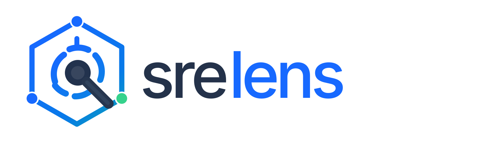

<p align="center">
  
</p>

<p align="center">
  A fast, lightweight Kubernetes IDE built with <a href="https://v2.tauri.app">Tauri v2</a> and a pure-Rust core —
  every backend capability is also exposed as an <a href="https://modelcontextprotocol.io">MCP</a> tool, so AI agents can drive your clusters through the same code paths as the UI.
</p>

---

## What is srelens?

srelens is a desktop workspace for operating Kubernetes clusters, inspired by
[Freelens](https://github.com/freelensapp/freelens)/Lens but rebuilt from scratch on a modern stack:

- **Tauri v2 instead of Electron** — system WebView, small binary, low memory footprint.
- **Pure-Rust backend** — kubeconfig discovery, cluster connections, watches, exec, port-forward, and logs are all Rust (`kube-rs`, `tokio`), no Node.js in the core.
- **MCP-native by design** — every backend operation is declared once in a capability registry and surfaced twice: as a Tauri command for the UI *and* as an MCP tool for external agents (Claude, IDEs, automation). A CI completeness test guarantees the two surfaces never drift.

## Features

- **Multi-cluster workspace** — kubeconfig discovery (including additional files and pasted configs), context switching, cluster hotbar, per-context avatars and colors.
- **Live resource browsing** — workloads, services, nodes, events, and custom resources (CRDs) with server-side watches streaming into the UI.
- **Resource detail & YAML** — manifest view, schema-aware YAML editing (CodeMirror) with validation and apply, resource events, workload relations.
- **Operations** — scale, rollout restart, delete/evict pods, cordon/drain nodes, port-forward management — destructive actions gated behind confirmation.
- **Pod terminal & logs** — interactive `exec` sessions (xterm.js) and live log streaming with follow.
- **Helm** — browse installed releases and inspect release details.
- **Metrics** — node and pod metrics (metrics-server) with usage overviews and sparklines.
- **Command palette** — keyboard-first navigation across contexts, resources, and actions.

## MCP server

The same binary that runs the GUI can run as an MCP server, exposing the full capability registry:

```sh
# stdio transport (for local agents / IDE clients)
srelens-desktop --mcp-stdio

# HTTP transport (loopback only, default 127.0.0.1:8765)
srelens-desktop --mcp-http [addr]
```

Destructive tools (delete, drain, apply, …) carry annotations and require an explicit `_confirm` argument.

Example Claude Desktop / MCP client config:

```json
{
  "mcpServers": {
    "srelens": {
      "command": "/path/to/srelens-desktop",
      "args": ["--mcp-stdio"]
    }
  }
}
```

## Quick start

Prerequisites: [Rust](https://rustup.rs) (stable), [Node.js](https://nodejs.org) 22+, [pnpm](https://pnpm.io) 9+, and the [Tauri v2 system dependencies](https://v2.tauri.app/start/prerequisites/) for your platform.

```sh
pnpm install
pnpm dev          # launches the desktop app with hot reload
```

Other useful commands:

```sh
pnpm test         # all JS/TS tests (Vitest, with coverage)
cargo test        # all Rust tests
pnpm build        # production frontend build
pnpm tauri build  # packaged desktop binaries
```

See the [developer guide](docs/DEVELOPMENT.md) for architecture, testing standards, and how to add a new capability.

## Repository layout

```
apps/desktop/            Tauri app
  src/                   React 19 + TypeScript UI (shadcn/radix, MobX, xterm, CodeMirror)
  src-tauri/             Rust backend: commands, streams, capability registration
crates/
  capability/            Capability registry — single source of truth for backend ops
  kube/                  Kubernetes integration (kubeconfig, watches, actions, helm, metrics)
  mcp/                   MCP server (stdio + HTTP) generated from the registry
docs/                    Project documentation
```

## Project status

srelens is in **early, active development**. The read/browse/operate core described above works end-to-end; extension support, broader resource coverage, and packaging polish are on the roadmap. Expect breaking changes.
